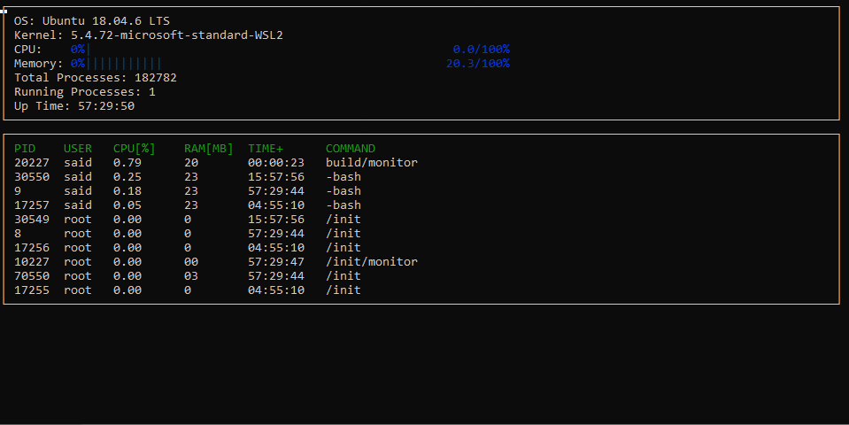

# CppND-System-Monitor

This is the second project in Udacity C++ nano degree. The starter code can be found in [Udacity's github repository](https://github.com/udacity/CppND-System-Monitor-Project-Updated).

The starter code has been completed according to the project instructions and the lessons in the course. The final monitor program output is 



## Compiling, building application and running the system monitoe

To build and run the application follow the following steps:
1. Clone the repository with 
```
git clone https://github.com/SaidZahrai/CppND-System-Monitor-Project-Updated .
```

2. Go to the cloned directory
```
cd CppND-System-Monitor-Project-Updated
```

3. Build the application
```
make build
```

4. Run the system monitor
```
./build/monitor
```

5. Stop monitoring with <CNTL> C. 

## Make
As noticed, the project uses [Make](https://www.gnu.org/software/make/). In addition to `build`, the Makefile has three more targets:
* `format` applies [ClangFormat](https://clang.llvm.org/docs/ClangFormat.html) to style the source code
* `debug` compiles the source code and generates an executable, including debugging symbols
* `clean` deletes the `build/` directory, including all of the build artifacts

## Notes on implementation

The implementation simply follows the instructions. I noticed that when a process is stopped, there will be a risk for having incorrect inputs. To avoid problems in conversion between string and numbers, I used the following two methods:

```
long safe_stol(string l){
  long value = 0;
  try{
    value = std::stol(l);
  }
  catch (...)
  {}
  return value;
}

int safe_stoi(string l){
  int value = 0;
  try{
    value = std::stoi(l);
  }
  catch (...)
  {}
  return value;
}


```